# MangosSuperUI

A web-based server management and content development platform for [VMaNGOS](https://github.com/vmangos/core) 1.12.1 vanilla WoW private servers. Built with ASP.NET Core 8.0 MVC, jQuery, and MariaDB/MySQL. Runs on Linux, developed on Windows.

MangosSuperUI aims to make running and building on a VMaNGOS server more accessible by bringing server operations, player administration, live log streaming, content editors with 3D model previews, a visual world map with click-to-place game objects, a Diablo-style loot variant generator, and a universal database explorer with auto-discovered relationship graphs and ER diagrams into a single web interface — all with a full audit trail on every action.

> **⚠️ Work in Progress:** MangosSuperUI is functional and actively used, but it is not finished. Existing features may have bugs, and entire sections (vendors, creatures, quests) are not yet built. I'm releasing it now so the community can use it, give feedback, and help improve it for everyone's benefit.

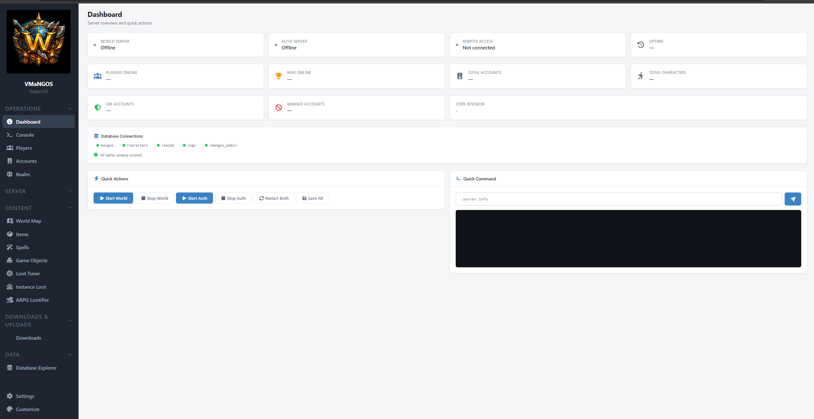

## Disclaimer

This project is not affiliated with or endorsed by Blizzard Entertainment.
World of Warcraft® is a registered trademark of Blizzard Entertainment, Inc.
MangosSuperUI does not distribute any Blizzard assets — icons, models, and minimap tiles are extracted from your own WoW 1.12.1 client using the included extractor tool.

---

## Current Release: Phases 1–3.5

MangosSuperUI is under active development. This release covers the core platform, content editors for items, spells, game objects, and loot tables, and the Database Explorer. See the [Roadmap](#roadmap) for what's coming next.

---

## Features

### Operations

**Dashboard** — At-a-glance server health. Process status for mangosd and realmd (start/stop/restart), RA connection status, all five database connections, players online, uptime, and core revision. If something's red, you know immediately.


**Console** — Full RA terminal in the browser via SignalR. Send any GM command, see the response in real time. Command history, autocomplete from a curated command list.

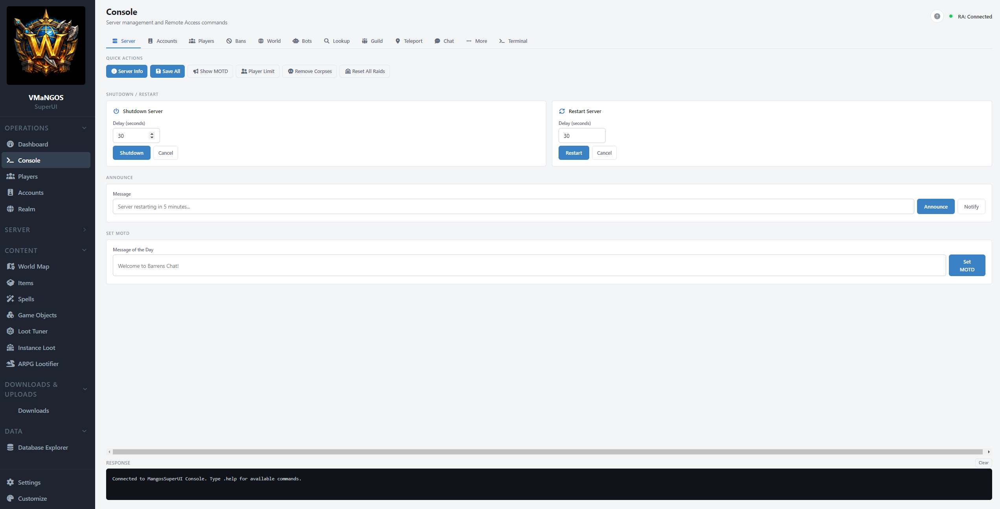

**Players** — Search, inspect, and manage characters. Kick, mute, ban, teleport, send mail, send items, reset stats. Everything audit-logged.

**Accounts** — Account management. Create, modify GM levels, ban/unban, view account history.

**Realm** — Edit the realmlist table directly. Useful for changing your realm name or address without touching SQL.

### Server

**Activity Log** — Every action MangosSuperUI takes is recorded in an append-only audit log. Full before/after state snapshots, RA commands sent, operator IP, timestamps. Filter by category, action type, or target.

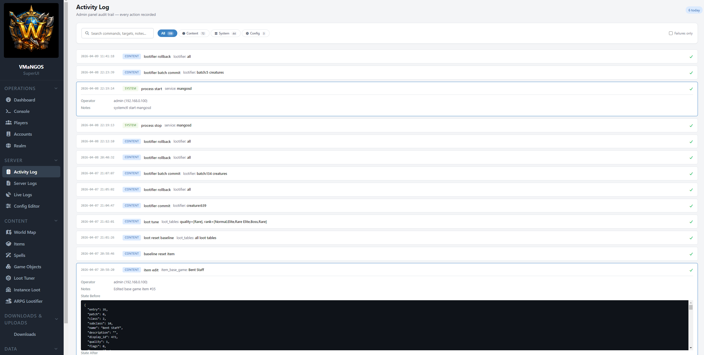

**Server Logs** — Browse the VMaNGOS database log tables across 8 tabs. Search, filter, paginate through historical server events.

**Live Logs** — Real-time log file tailing via SignalR. Watches your mangosd log files and streams new lines to the browser every 500ms. No more `tail -f` in a terminal.

**Config Editor** — All 601 `mangosd.conf` settings organized into 22 human-readable tabs with descriptions, current values, and inline editing. Built from a curated metadata JSON that maps raw config keys to categories and explanations. No more hunting through a 2,000-line conf file.

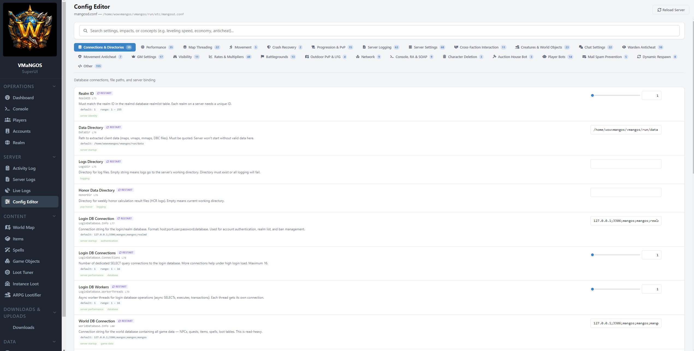

### Content

**World Map** — Leaflet.js-powered minimap tile viewer. Browse Azeroth, Kalimdor, dungeons, and raids using tiles extracted from your WoW client. Click anywhere to place a game object at that location — the HeightMapService reads VMaNGOS `.map` binary files to resolve terrain Z coordinates automatically. Compass widget for setting orientation. Spawn overlay shows existing game objects on the map.

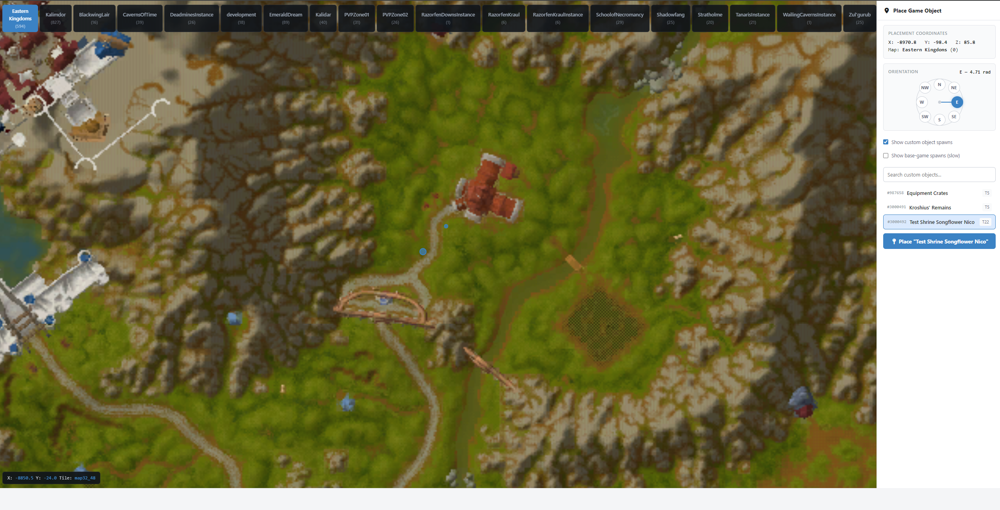

**Items** — Browse all 25,000+ items in the mangos database. Search, filter, paginate. Click any item for a full detail panel with stats, spells, and loot sources. 3D model viewer shows automatically for items that have an extractable model. Clone any base game item to create custom variants, or edit custom items directly. Icon picker with DBC-resolved icon names.

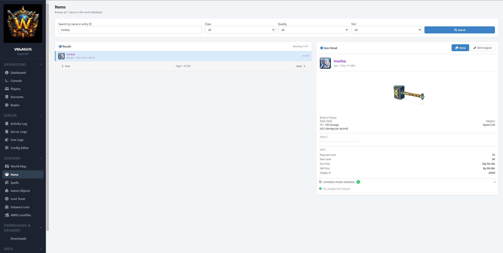

**Spells** — Browse and search the full spell_template table. Grouped search across spell families. Edit spell fields directly, or batch-edit multiple spells at once. DBC-resolved spell icons, duration, cast time, and range values.

**Game Objects** — Browse, search, clone, edit, and delete game objects. 3D model viewer shows automatically when an extracted model exists for the object's display ID. Custom summary field for quick identification. Full integration with the World Map for visual placement.

**Loot Tuner** — Bulk loot rate adjustment. Filter by item quality, level range, creature rank, dungeon/raid. Apply multipliers across matching loot tables. Baseline system tracks all changes with visual diffs and one-click reset to original values.

**Instance Loot** — Per-boss loot editing for all 26 instances. Curated boss list (~256 entries) via `instance-bosses.json`. View the full loot tree for any boss with reference chain expansion. Edit drop rates, add or remove items from loot tables.

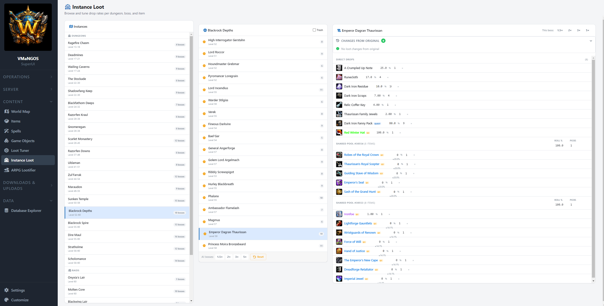

**ARPG Lootifier** — This is the fun one. A Diablo-style item variant generator layered on top of vanilla WoW data. Pick a creature (or batch-select by quality/level/rank/instance), and the engine generates N stat-rerolled variants of each item in their loot table, then expands the loot tables so variants drop alongside originals.

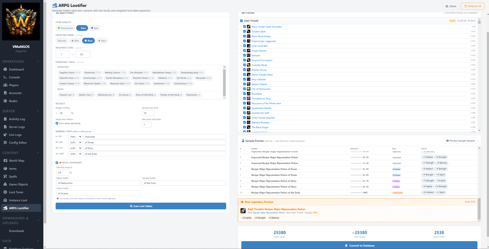

The Lootifier features:

- **Tier-quota system** — variants are pre-allocated across tiers: Improved (prefix), of Power, of Glory, of the Gods (suffixes). Each tier has a budget range and naming convention. All configurable.
- **Stat family detection** — items auto-classified as physical, caster, or hybrid. New affixes only added from the same family.
- **Spell-effect items** — trinkets and proc weapons with no stat slots get bonus stats derived from item level. Spell effects preserved.
- **Quality promotion** — high-tier variants promoted to Epic (purple) or Legendary (orange) quality.
- **Legendary system** — optional boss-named legendaries at 150% budget with configurable drop rates. "Edwin VanCleef's Cruel Barb" type naming with overlap detection.
- **Batch mode** — run the Lootifier across entire dungeons or raids in one operation with full preview before commit.
- **Full rollback** — per-creature or global. Every generated item and loot table change is tracked for clean undo.

### Data

**Database Explorer** — A universal, metadata-driven browser for all four VMaNGOS databases (mangos, characters, realmd, logs) — 255 tables total. This isn't phpMyAdmin. The Database Explorer treats the VMaNGOS schema as a connected graph, not isolated tables.

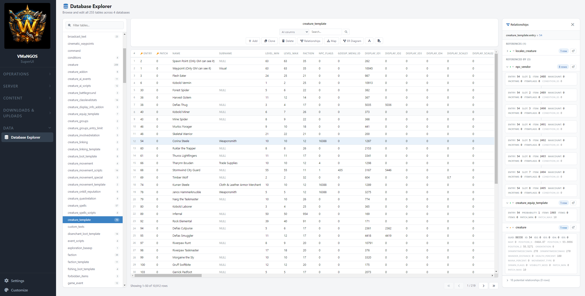

VMaNGOS uses MyISAM with no declared foreign keys. MangosSuperUI solves this with a relationship discovery pipeline — a Python script that brute-force tests value overlap across every integer column pair in the schema, then scores and filters candidates using naming heuristics. The result: **749 curated relationship edges** (222 proven, 527 likely) shipped as a JSON file that the explorer loads at startup.

What you get:

- **Data grid** — paginated, sortable, searchable. Inline editing — double-click any cell to edit, Tab to advance, Enter to commit. Insert and delete rows. All mutations audit-logged with before/after state.
- **Relationship panel** — select any row and see every table connected to it, split into "References" (outbound) and "Referenced By" (inbound) with row counts. Expand any relationship to see the actual connected rows inline. Click to navigate — the explorer follows the relationship and pushes a breadcrumb so you can trace back.
- **Map view** — vertical relationship visualization centered on your selected row. Outbound references above, inbound below, connected by visual lines. Expand any card to see rows inline.
- **ER diagram** — interactive SVG entity-relationship diagram for any table. Radial layout with the selected table at center, all connected tables arranged around it. Column-level detail with PK/FK highlighting. Proven edges drawn solid, likely edges dashed. Pan, zoom, click any node to recenter, double-click to navigate into that table.
- **Breadcrumb navigation** — every relationship click pushes a breadcrumb. Trace paths like `creature_template → creature_loot_template → item_template → item_enchantment_template` and jump back to any point.
- **CSV export** — export any table or filtered view. RFC 4180 compliant with formula injection prevention.
- **Column name toggle** (WIP) — swap between raw column names and custom human-readable names. Double-click any header to set your own label, persisted to localStorage. No pre-built mappings yet — you define them as you go.
- **Read-only enforcement** — `characters` and `logs` databases are read-only at the controller level. Tables without primary keys are also read-only.

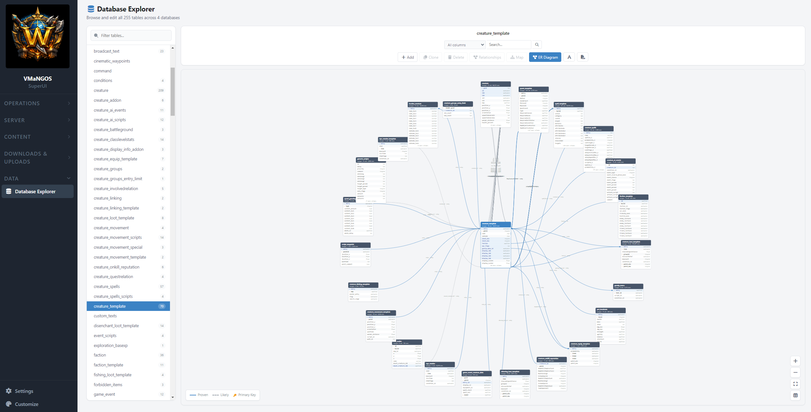

### OG Baseline System

Pristine snapshots of your mangos tables taken before you start editing. Every content page (Items, Spells, Game Objects, Loot Tuner, Instance Loot, Lootifier) shows field-level diffs against the original values. One-click reset at any level — per item, per boss, per instance, per table, or full nuclear reset. Custom items (entry ≥ 900000) are excluded since they have no original.

### Downloads & Uploads

Host WoW addon ZIPs for your players to download. Auto-generates a `Catalog.lua` file for the MangosSuperUI_Placer addon — a companion WoW addon that lets players place game objects in-game with `.gobject` commands.

### Sidebar & Theme Customization

Collapsible navigation groups, drag-to-reorder via a customize modal, and a full theme color picker for every major CSS variable (sidebar, content area, cards, accent, text). All persisted to localStorage. Make it yours.

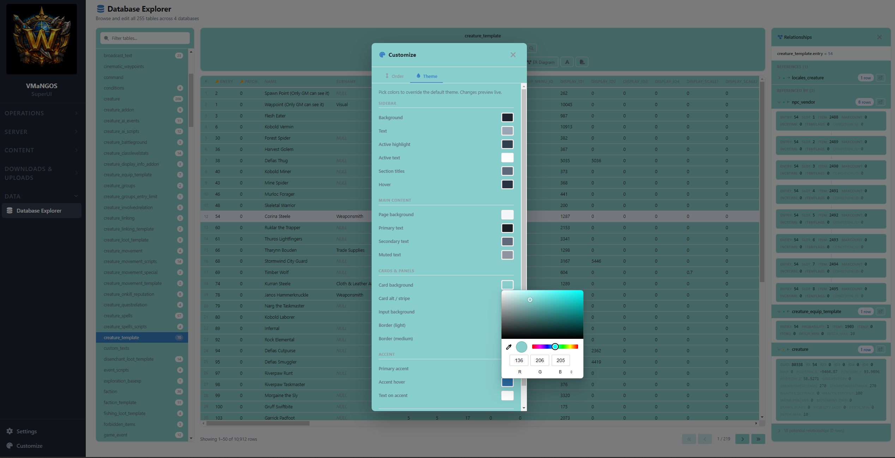

---

## Architecture

Every page follows the same pattern:

```
Controller (C#)          →  View (Razor .cshtml)      →  JS file (jQuery)
Routes, DB queries,         Thin HTML shell,              All dynamic rendering,
RA commands, audit          scoped CSS                    AJAX calls, DOM updates
```

C# handles routing, business logic, and database access. Views are minimal HTML skeletons. JavaScript drives all UI rendering dynamically. This means every page is essentially a single-page app inside the MVC shell.

Key services:

- **RaService** — singleton persistent TCP connection to mangosd's RA interface. Every GM command goes through here.
- **AuditService** — append-only audit trail. Every action logged with operator, IP, category, target, RA command/response, and full before/after state as JSON.
- **DbcService** — parses WoW 1.12.1 DBC binary files at startup for icon resolution, spell metadata, and display info lookups.
- **HeightMapService** — reads VMaNGOS `.map` binary files for terrain Z-coordinate resolution on the World Map.
- **ProcessManagerService** — starts/stops/restarts mangosd and realmd via passwordless sudo systemctl.

Database access uses Dapper for VMaNGOS tables (read-heavy, raw SQL) and EF Core for MangosSuperUI's own `vmangos_admin` database. All VMaNGOS game-state mutations go through RA commands, with exceptions for direct table writes (items, spells, game objects, loot tables) that are fully audit-logged with before/after state.

The Database Explorer adds a relationship discovery layer — a ~6MB JSON file of pre-computed edges loaded once at startup, with three indexed dictionaries for fast lookup. All SQL identifiers are validated against a schema whitelist before query construction.

---

## Requirements

- A working **VMaNGOS 1.12.1** server (compiled, databases populated, able to log in and play)
- **Ubuntu 22.04+** or similar Linux (tested on Ubuntu 24.04)
- **ASP.NET Core 8.0 Runtime** (or SDK if building from source)
- **MariaDB 10.x+** or MySQL 5.5+ (whatever VMaNGOS is using)
- **WoW 1.12.1 client** (for asset extraction — optional but recommended)

MangosSuperUI does NOT cover compiling VMaNGOS or populating the world database. See the [VMaNGOS Wiki](https://github.com/vmangos/wiki) for that.

---

## Installation

See **[INSTALL.md](INSTALL.md)** for the full step-by-step guide covering:

- **Part 1:** VMaNGOS prerequisites — RA configuration, systemd services, account setup, sudo permissions
- **Part 2:** MangosSuperUI deployment — .NET runtime, download/build, systemd service, setup script, dashboard verification
- **Part 3:** Asset extraction — icons, 3D models, and minimap tiles from your WoW client (optional)

The setup script auto-discovers your VMaNGOS paths, database connections, and configuration from `mangosd.conf`. The only thing you provide manually is your RA username and password.

---

## Roadmap

MangosSuperUI is built in phases. This release is **Phases 1–3.5**.

### Released (Phases 1–3.5)

Everything listed above in [Features](#features). Server management, content editors for items/spells/game objects/loot, world map, Database Explorer with relationship graphs and ER diagrams, theme customization, full audit trail.

### Development Philosophy

If any single feature or phase hits a wall beyond ~50 hours of effort, I'll skip it and move on to the next phase or section rather than throttle progress on everything else. The goal is steady forward momentum across the whole platform, not getting stuck on one piece.

### Phase 4 — Playerbot Management

VMaNGOS supports playerbots that simulate real players in the world. Phase 4 brings bot management into the UI:

- Playerbot dashboard — spawn, despawn, configure, and monitor bots from the web interface
- LLM-driven personality system — bots with distinct personalities, chat styles, and behavioral tendencies powered by local AI inference (Ollama)
- Complex interactions — bots that respond to player chat, form groups, run dungeons, and make decisions based on their personality profiles
- Scripting interface — define bot behaviors and event responses through the UI without touching code

### Phase 5 — World Building

Broader content creation tools for shaping the game world beyond items and loot:

- **Vendors & Creatures** — new sidebar section. Browse, edit, and create NPCs. Manage vendor inventories (`npc_vendor`), trainer spell lists (`npc_trainer`), and creature templates
- **Quests** — quest template editor for creating custom content. Quest reward lootification via `quest_mail_loot_template` (research complete, implementation pending)
- **Game Tuning** — XP rate sliders, honor rate sliders, reputation multipliers. Rapid iteration knobs for tuning the overall game feel without restarting the server
- **NPC/creature spawn overlay on World Map** — visual placement of creatures alongside game objects, with search and filtering

### Other Planned Work

- Docker Compose packaging for one-command deployment
- Configurable original-item share in the Lootifier (currently hardcoded at 40%)
- Loot table expansion math preview (before/after percentages)
- Undo button on reversible audit entries
- Database Explorer: saved queries, column visibility toggle, baseline diff view

---

## Tech Stack

| Layer | Technology |
|-------|-----------|
| Backend | ASP.NET Core 8.0 MVC (C#) |
| Frontend | jQuery, vanilla JS, Bootstrap |
| Real-time | SignalR (Console, Live Logs) |
| Database | MariaDB/MySQL via Dapper (VMaNGOS) + EF Core (admin) |
| 3D Models | Google model-viewer (GLB format) |
| World Map | Leaflet.js with custom tile layers |
| ER Diagrams | Custom SVG rendering with pan/zoom |
| DBC Parsing | Custom binary parser (DbcService) |
| Heightmaps | Custom binary parser (HeightMapService) |
| Relationship Discovery | Python script → scored JSON (749 edges across 255 tables) |
| Asset Extraction | [MangosSuperUI Extractor](https://github.com/Yafrovon/MangosSuperUI_Extractor) (separate tool, WinForms + War3Net.IO.Mpq) |

---

## Project Structure

```
MangosSuperUI/
├── Controllers/          # 20 controllers — one per page + API endpoints
├── Services/             # Core services (RA, Audit, DBC, HeightMap, Process Manager)
├── Models/               # ConnectionFactory, POCOs
├── Hubs/                 # SignalR hubs (Console, Live Logs)
├── Views/                # Razor views — thin HTML shells
├── wwwroot/
│   ├── js/               # One JS file per page — all dynamic rendering lives here
│   ├── css/              # Global theme, baseline styles, help overlay
│   ├── data/             # Curated JSON (commands, config metadata, instance bosses, relationships)
│   ├── lib/              # Vendored libs (Leaflet, model-viewer)
│   ├── addons/           # MangosSuperUI_Placer WoW addon
│   ├── icons/            # Item/spell icon PNGs (user-extracted)
│   ├── models/           # Game object GLB models (user-extracted)
│   ├── item_models/      # Item GLB models (user-extracted)
│   └── minimap/          # Minimap tile PNGs (user-extracted)
└── sql/                  # vmangos_admin schema
```

---

## Contributing

See **[CONTRIBUTING.md](CONTRIBUTING.md)** for the full guide. The short version:

Open an issue before submitting a PR. Bug reports, feature requests, and documentation improvements are all welcome.

If you're adding a new page, follow the existing pattern: controller for routing and data, thin Razor view for the HTML shell, JS file for all dynamic rendering. Keep VMaNGOS database writes going through RA commands where possible, with direct SQL only for content tables (items, spells, game objects, loot) — and always audit-log the before/after state.

---

## Acknowledgments

MangosSuperUI was built with [Claude](https://claude.ai) (Anthropic) as a primary development resource — the same way I use it in my professional work. Claude was instrumental in architecture decisions, code generation, debugging, and documentation across the entire project. This would have taken significantly longer without it.

More fundamentally, none of this would exist without the years of work by the people who built and documented the systems underneath it. The VMaNGOS team and the broader MaNGOS lineage. The WoW modding community that reverse-engineered DBC formats, loot table mechanics, stat budget formulas, and the RA protocol. The wiki editors, forum posters, and GitHub contributors who wrote it all down so someone like me could find it fifteen years later. MangosSuperUI is a UI layer on top of knowledge that thousands of people contributed over two decades. I just made it clickable.

---

## License

This project is licensed under the **GNU General Public License v2.0**. See [LICENSE](LICENSE) for the full text.

Third-party library licenses are documented in [THIRD_PARTY_NOTICES.md](THIRD_PARTY_NOTICES.md).